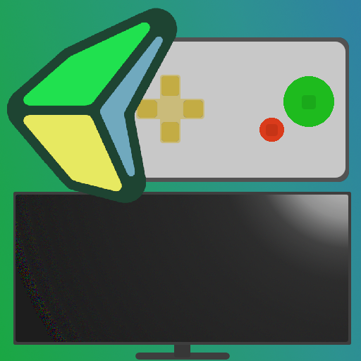

# GameNite Controlpads Library for Godot
 

  

## Description

This repository contains source for the GameNite Controlpads Godot plugin, as
well as the plugin itself. The plugin can be used to develop for GameNite and
test your GameNite game natively.

## Usage

- Download GameNite Controlpads from the AssetLib in Godot.
- Add a GameNiteControlpads node to your main scene (do not use more than one
  GameNiteControlpads node in your game).
- Add a script to your new node
- Attach a function to the `message_received` signal to handle messages from
  controlpad.
- Use the built in `send_message` function.
- Run a controlpads test server on your development machine:
  https://github.com/RecBox-Games/controlpad_test_server
- Connect browsers on your computer or phone to `<your-lan-ip>:3000`.
- Join our discord to get help and learn more about developing for GameNite:
  https://discord.gg/JN6NrUcBhr

  ## Building from source
  `cd godot-cpp`
  `git submodule update --init`
  `godot --dump-extension-api extension_api.json`
  `scons platform=<platform> -j4 custom_api_file=extension_api.json`
  `cd ..`
  `scons platform=<platform>` // you may want to add `target=template_release` flag
